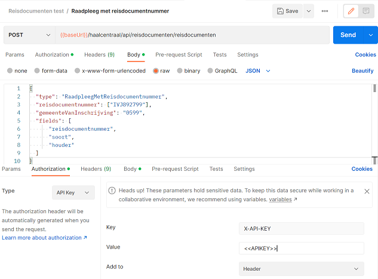

# Aan de slag met de Haal Centraal {{ site.apinaame }} Web API

De '{{ site.apiname }}' Web API biedt functionaliteit om gegevens van reisdocumenten te bevragen.

1. Bekijk de [API specificatie en functionele documentatie](#api-specificatie-en-functionele-documentatie)
2. Probeer de API in de [proef omgeving](#probeer-de-api-in-de-proef-omgeving)
3. Probeer de Proxy [lokaal](#probeer-de-proxy-lokaal)
4. Routeer Proxy aanroepen naar de [GBA variant van de '{{ site.apiname }}' in de proef omgeving](#routeer-proxy-aanroepen-naar-de-gba-variant-van-de-web-api-in-de-proef-omgeving)

## API specificatie en functionele documentatie

De '{{ site.apiname }}' Web API is gespecificeerd met behulp van de [OpenAPI Specification v3.0.3](https://spec.openapis.org/oas/v3.0.3){:target="_blank" rel="noopener"}.

De OAS3 specificatie van de '{{ site.apiname }}' Web API kan worden bekeken met behulp van [Redoc](./redoc).

De [functionele documentatie](./features-overzicht) van de '{{ site.apiname }}' Web API vindt je in de [features overzicht](./features-overzicht).

## Probeer de API in de proef omgeving

De functionaliteit van de '{{ site.apiname }}' Web API kan worden uitgeprobeerd in de proef omgeving. De API is te bevragen op de volgende endpoint: [{{ site.proefProxyUrl }}/haalcentraal/api/reisdocumenten/reisdocumenten]({{ site.proefProxyUrl }}/haalcentraal/api/reisdocumenten). Hiervoor heb je een apikey nodig.

De proef omgeving ontsluit reisdocumenten die voorkomen in de [Testdataset Basisregistratie Personen](https://www.rvig.nl/brp/werken-met-de-basisregistratie-personen-brp/testdataset){:target="_blank" rel="noopener"}

Vraag een apikey aan bij de [product owner](mailto:{{ site.PO-email }}) of gebruik de apikey die is uitgereikt op de API Labs.

Met behulp van de volgende curl statement wordt op basis van een reisdocumentnummer gegevens van de bijbehorende reisdocument opgehaald

```sh

curl --request POST \
--url 'https://proefomgeving.haalcentraal.nl/haalcentraal/api/reisdocumenten/reisdocumenten' \
--header 'Content-Type: application/json' \
--header 'X-API-KEY: <<APIKEY>>' \
--data '{
  "type": "RaadpleegMetReisdocumentnummer",
  "reisdocumentnummer": ["IX34JH673"],
  "gemeenteVanInschrijving": "1810",
  "fields": [
      "reisdocumentnummer",
      "soort",
      "houder"
  ]
}'

```

Onderstaand figuur visualiseert de configuratie van bovenstaande aanroep in Postman



## Probeer de Proxy lokaal

Door wettelijke restricties kan de '{{ site.apiname }}' Web API bepaalde bewerkingen niet uitvoeren. Er wordt op dit moment gewerkt aan het Experimentbesluit Dataminimalisatie om deze restricties weg te halen. Totdat dit is vastgesteld moet de '{{ site.apiname }}' Proxy worden gebruikt om de bewerkte gegevens te kunnen krijgen.

De '{{ site.apiname }}' Proxy is een containerized applicatie die in de omgeving van een consumer moet worden gehost. Bevragingen van de '{{ site.apiname }}' Web API moet naar de '{{ site.apiname }}' Proxy worden gestuurd, zodat deze de bevragingen kan routeren naar de GBA variant van de '{{ site.apiname }}' Web API. Responses van deze Web API worden getransformeerd naar responses conform de {{ site.apiname }} [OAS3 specificatie]({{ site.v2SpecUrl }}){:target="_blank" rel="noopener"} voordat deze worden gestuurd naar de bevrager.

Onderstaand figuur illustreert hoogover de communicatie tussen een consumer applicatie en een Haal Centraal Web API.


De '{{ site.apiname }}' Proxy kan lokaal worden uitgeprobeerd met behulp van [Docker Desktop](https://www.docker.com/products/docker-desktop){:target="_blank" rel="noopener"}. Hiervoor moet:

- [Docker Desktop](https://www.docker.com/products/docker-desktop){:target="_blank" rel="noopener"} op een Windows of Mac PC worden geïnstalleerd
- op dezelfde Windows of Mac PC het [docker compose bestand]({{ site.v2DockerComposeUrl }}){:target="_blank" rel="noopener"} worden gedownload

Vervolgens moet een command prompt worden gestart in de map met het gedownloade [docker compose bestand]({{ site.v2DockerComposeUrl }}){:target="_blank" rel="noopener"} en moet in de command prompt de volgende statement worden uitgevoerd om de '{{ site.apiname }}' Proxy op te starten:

```sh

docker-compose up -d

```

Behalve de '{{ site.apiname }}' Proxy wordt lokaal ook een mock van de GBA variant van de '{{ site.apiname }}' Web API opgestart. De mock maakt om lokaal zonder apikey de functionaliteit van de '{{ site.apiname }}' Web API uit te proberen.

Met behulp van de volgende curl statement wordt op basis van een reisdocumentnummer gegevens van de bijbehorende reisdocument via de '{{ site.apiname }}' Proxy bij de mock opgehaald

```sh

curl --request POST \
--url 'http://localhost:5002/haalcentraal/api/reisdocumenten/reisdocumenten' \
--header 'Content-Type: application/json' \
--data '{
  "type": "RaadpleegMetReisdocumentnummer",
  "reisdocumentnummer": ["IX34JH673"],
  "gemeenteVanInschrijving": "1810",
  "fields": [
      "reisdocumentnummer",
      "soort",
      "houder"
  ]
}'

```

Om de Proxy en de mock containers te stoppen moet de volgende statement worden uitgevoerd:

```sh

docker-compose down

```

## Routeer Proxy aanroepen naar de GBA variant van de Web API in de proef omgeving

Stop de proxy container met behulp van de volgende statement:

```sh

docker-compose down

```

Voeg de volgende environment variabelen toe aan de configuratie van de '{{ site.apiname }}' Proxy in het [docker compose bestand]({{ site.v2DockerComposeUrl }}){:target="_blank" rel="noopener"}:

- Routes__0__DownstreamScheme. De communicatie protocol die moet worden gebruikt voor het aanroepen van de {{ site.apiname }} Web API GBA variant
- Routes__0__DownstreamHostAndPorts__0__Host. De host naam van de aan te roepen {{ site.apiname }} Web API GBA variant
- Routes__0__DownstreamHostAndPorts__0__Port. De port nummer van de aan te roepen  {{ site.apiname }} Web API GBA variant

De configuratie van de '{{ site.apiname }}' Proxy ziet er dan als volgt uit:

```yaml

  reisdocumentproxy:
    container_name: reisdocumentproxy
    image: ghcr.io/brp-api/haal-centraal-reisdocument-bevragen-proxy:latest
    build:
      context: .
      dockerfile: src/ReisdocumentProxy/Dockerfile
    environment:
      - ASPNETCORE_ENVIRONMENT=Release
      - ASPNETCORE_URLS=http://+:5000
      - Routes__0__DownstreamScheme=https
      - Routes__0__DownstreamHostAndPorts__0__Host=proefomgeving-gba.haalcentraal.nl
      - Routes__0__DownstreamHostAndPorts__0__Port=443
    ports:
      - "5002:5000"
    networks:
      - reisdocumenten-api-network

```

Start de '{{ site.apiname }}' Proxy met behulp van de volgende statement:

```sh

docker-compose up -d

```

Met behulp van de volgende curl statement wordt op basis van een reisdocumentnummer gegevens van de bijbehorende reisdocument via de '{{ site.apiname }}' Proxy bij de GBA variant van de '{{ site.apiname }}' Web API in de proef omgeving opgehaald

```sh

curl --request POST \
--url 'http://localhost:5002/haalcentraal/api/reisdocumenten/reisdocumenten' \
--header 'Content-Type: application/json' \
--header 'X-API-KEY: <<APIKEY>>' \
--data '{
  "type": "RaadpleegMetReisdocumentnummer",
  "reisdocumentnummer": ["IX34JH673"],
  "gemeenteVanInschrijving": "1810",
  "fields": [
      "reisdocumentnummer",
      "soort",
      "houder"
  ]
}'

```
